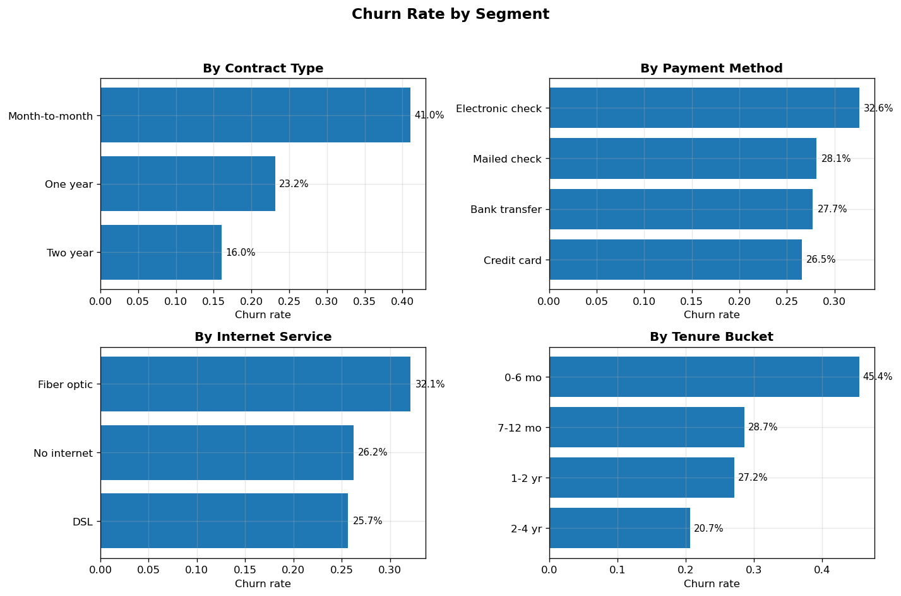
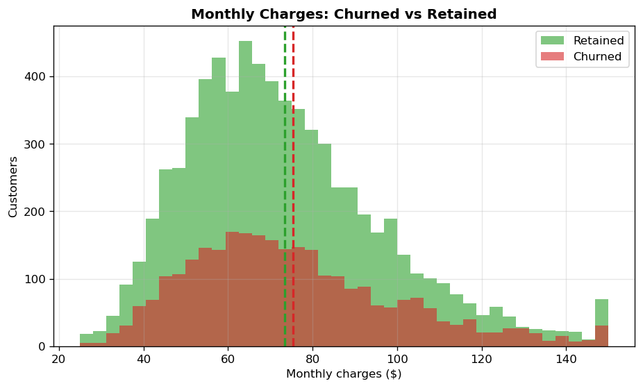

# Customer Churn Insights Dashboard

An end-to-end churn analysis for a telecom customer base: synthetic dataset generation, exploratory analysis in pandas, static charts (matplotlib), and a **self-contained interactive HTML dashboard (Plotly)** — no server required.




## 📌 Business Problem

Customer churn is one of the costliest problems a subscription business faces — acquiring a new customer costs far more than retaining one. This project answers:

1. What is our overall churn rate?
2. Which customer segments churn the most (contract type, tenure, payment method)?
3. What are the top churn drivers and stated churn reasons?
4. Do support interactions or pricing correlate with churn?
5. How much monthly revenue is at risk from churned customers?

## 📂 Project Structure

```
customer-churn-insights-dashboard/
├── generate_data.py              # Seeded synthetic data generator (seed 42)
├── churn_analysis.py             # pandas analysis: segments, drivers, charts
├── dashboard.py                  # Builds dashboard.html (interactive Plotly)
├── dashboard.html                # ⭐ Self-contained dashboard — open in any browser
├── data_customers.csv            # Generated dataset (10,000 rows)
├── churn_summary_contract_tenure.csv  # Segment summary table
├── images/                       # Static charts (matplotlib)
└── requirements.txt
```

## 🗃️ Dataset

`data_customers.csv` — **10,000 synthetic telecom customers**, generated with a seeded RNG (`generate_data.py`), so results are fully reproducible. No real customer data.

| Column | Description |
|---|---|
| `customer_id` | Unique ID (CUST-000001 …) |
| `signup_date` | Random date, 2022-01-01 → 2025-12-31 |
| `region` | Northeast / Midwest / South / West |
| `contract_type` | Month-to-month / One year / Two year |
| `payment_method` | Electronic check / Mailed check / Bank transfer / Credit card |
| `internet_service` | Fiber optic / DSL / No internet |
| `tenure_months` | 1–72 |
| `monthly_charges` | $25–$150 |
| `total_charges` | tenure × monthly charges |
| `support_calls` | 0–8 |
| `churned` | 1 = churned, 0 = retained |
| `churn_reason` | Stated reason (churned customers only) |

## 🔍 Methodology

1. **Data generation** (`generate_data.py`): seeded NumPy RNG builds realistic correlations — churn probability rises with month-to-month contracts, short tenure, frequent support calls, high charges, fiber internet, and electronic-check payments.
2. **Analysis** (`churn_analysis.py`): churn rate overall and by segment, tenure bucketing, support-call correlation, churned-vs-retained charge distributions, churn-reason breakdown, monthly cohort trend. Static charts saved to `images/` with matplotlib.
3. **Interactive dashboard** (`dashboard.py`): Plotly figures (bars, scatter, trend line, donut) plus styled HTML KPI cards, exported to a single self-contained `dashboard.html`.

The analysis approach mirrors my Power BI workflow: the KPIs here are the equivalent of DAX measures (e.g., `Churn Rate = DIVIDE(COUNTROWS(FILTER(Customers, Churned=1)), COUNTROWS(Customers))`), and Plotly's hover/legend interactivity stands in for Power BI slicers and drill-through.

## 📊 Key Findings (real results from the analysis run)

- **Overall churn rate: 28.94%** — 2,894 of 10,000 customers.
- **Contract type is the #1 driver:** Month-to-month customers churn at **41.04%** vs 23.19% (one year) and 16.05% (two year) — a +41.8% lift over average.
- **Early tenure is critical:** 0–6 month customers churn at **45.44%**; churn falls steadily to 20.68% for 2–4 year customers.
- **Payment method:** Electronic check payers churn at **32.57%** (+12.5% lift) — highest of any payment method.
- **Internet service:** Fiber optic customers churn at **32.11%** (+11.0% lift) vs 25.67% for DSL.
- **Support calls:** weak positive correlation with churn (r = 0.083) — service friction matters, but less than contract/tenure pricing dynamics.
- **Pricing gap is small:** churned customers paid $75.39/mo on average vs $73.44 for retained (+$1.95) — churn is driven more by *stated* price sensitivity than actual spend differences.
- **Top churn reason:** "Price too high" (**28.5%** of churned), followed by moving/relocation (20.0%) and competitor offers (19.4%).

**Recommendation:** target 0–6 month, month-to-month, electronic-check customers with proactive retention offers (e.g., discounted annual-plan upgrades) — that single segment carries the largest share of preventable churn.

## 🛠️ Skills Demonstrated

- **Python:** pandas (groupby aggregations, bucketing with `pd.cut`, correlations), NumPy (seeded synthetic data), matplotlib (publication-ready charts)
- **Plotly:** interactive bar charts, scatter plots, trend lines, donut charts, HTML dashboard assembly
- **Data storytelling:** KPI framing, segment analysis, driver identification, business recommendations
- **BI thinking:** DAX-style measure design and slicer concepts carried over from Power BI practice

## ▶️ How to Run

```bash
pip install -r requirements.txt

# 1. Generate the synthetic dataset
python generate_data.py

# 2. Run the analysis (prints findings, saves charts to images/)
python churn_analysis.py

# 3. Build the interactive dashboard
python dashboard.py
```

Then open **`dashboard.html`** in any browser — no server, no Streamlit, no backend needed.

## 📜 License

MIT — © 2026 Akshitha Yedla
